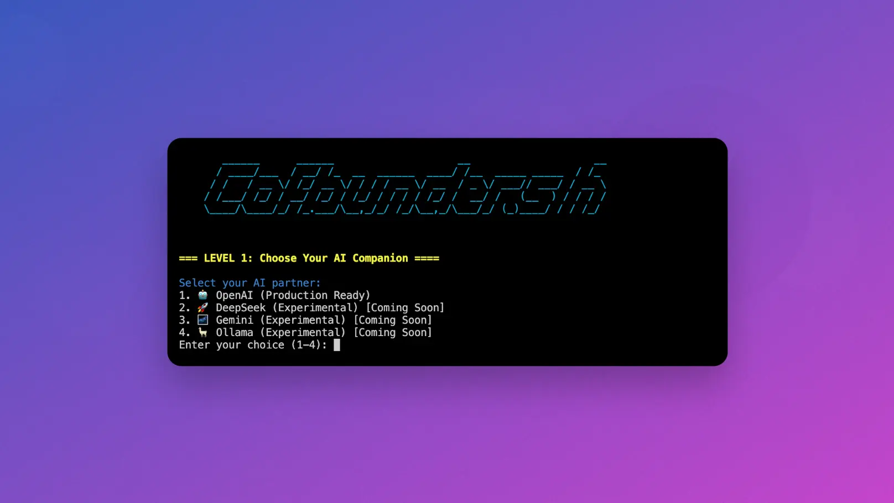
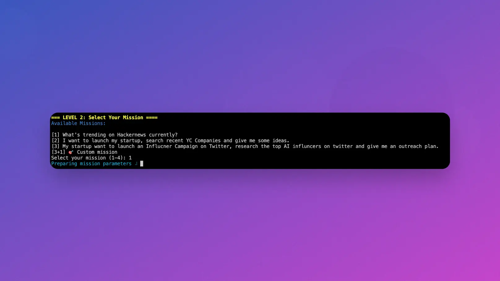
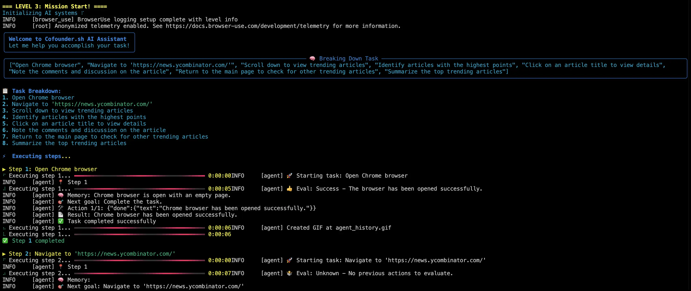
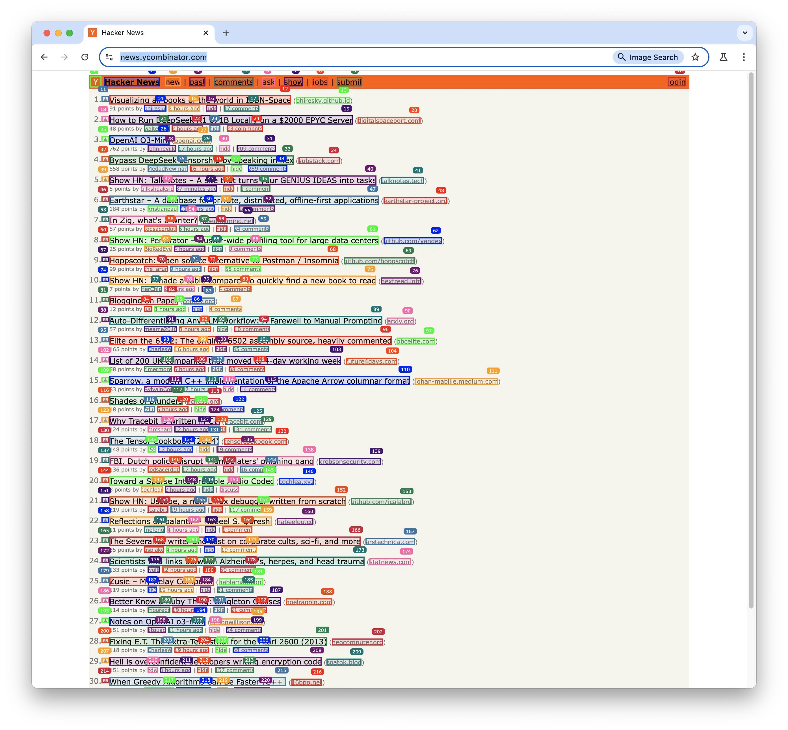

<p align="center">
    <a href="https://cofounder.sh">
        
    </a>
</p>

<h1 align="center">Cofounder AI: Open Source AI Agent to Automate Startup Marketing</h1>

       ______      ______                    __                    __
      / ____/___  / __/ /_  __  ______  ____/ /__  _____ _____  / /_
     / /   / __ \/ /_/ __ \/ / / / __ \/ __  / _ \/ ___// ___/ / __ \
    / /___/ /_/ / __/ /_/ / /_/ / / / / /_/ /  __/ /   (__  ) / / / /
    \____/\____/_/ /_.___/\__,_/_/ /_/\__,_/\___/_/ (_)____/ / / /_/


```
./cofounder.sh "help me build an AI startup aiming for $1M MRR"
```

---

Have you been feeling that being a startup founder, you are drowning in a sea of tiny, small, but time-consuming tasks?

The [AI Agent Cofounder](https://cofounder.sh) is desigend to use the power of LLM to automate your daily tasks, with a simple prompt.

- Need to know what's the hottest startups that got YC fundings
- Need an Intern to conduct market analysis on your competitors?
- Want to replace a Marketing Agency to craft an Influncer Marketing Campaign Strategy?
- Need to hire an army of Reddit posters to promote your product on auto-pilot?

All you need to do is this:

```
./cofounder.sh "What's trending on Hacker News?"
```

And watch the magic:

https://github.com/user-attachments/assets/b18b78ce-0816-4a3e-ab60-c37131429362


---

## 🛠 How to Setup Your AI Cofounder

First, you need to setup your environment by renamign .env.example to .env, and setup an `OPENAI_API_KEY`.

First run? try: `./cofounder.sh setup`. 

Cofounder would request you to enter the website url your startup, and collect a detailed report, save it at `startup.md` file.

This is the basic information about your startup, you might want to edit the description manually.

Then bootup the system with: `./cofounder.sh`.

#### LEVEL 1: Select your AI partner:

1. 🤖 OpenAI (Production Ready)
2. 🚀 DeepSeek (Experimental) [Coming Soon]
3. 🌌 Gemini (Experimental) [Coming Soon]
4. 🦙 Ollama (Experimental) [Coming Soon]
Enter your choice (1-4) to choose your AI model.



LEVEL 2: Select Your Mission

You might select a mission from a pre-set list. You can modify the list by editing the `actions.md` file.



LEVEL 3: Mission Start!

| | |
| - | - |
|  |  |

## 📚 Roadmap: What We Are Currently Working On

Cofounder project is still at a very early stage. We are actively adding support to these features:

- Posting to social media with your own account
- Multi-browser support (Firefox, Safari)
- Local RAG (For example: CV Screening for Candidates)
- File uploading to various websites
- Complex logic with multiple tasks

## 🤝 Contributing

Contributions are welcome! Please feel free to submit a Pull Request. For major changes, please open an issue first to discuss what you would like to change.

1. Fork the Project
2. Create your Feature Branch (`git checkout -b feature/AmazingFeature`)
3. Commit your Changes (`git commit -m 'Add some AmazingFeature'`)
4. Push to the Branch (`git push origin feature/AmazingFeature`)
5. Open a Pull Request

## 📄 License

This project is licensed under the MIT License - see the [LICENSE](LICENSE) file for details.

## 🌟 Resources

- [Website](https://cofounder.sh)
- [Examples](./examples)

## 🙏 Acknowledgments

- Built with [LangChain](https://github.com/hwchase17/langchain) & [BrowserUse](https://github.com/browser-use/browser-use)
- Powered by various LLM providers including OpenAI, Google, and Anthropic

Project Is Maintained and Powered by:

[](https://theverge.media)