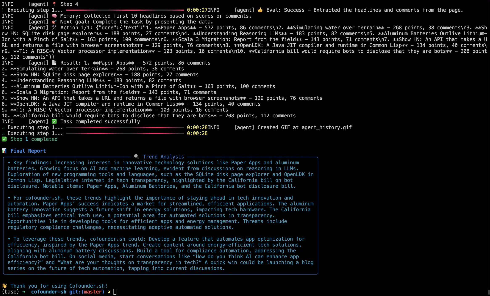

<p align="center">
    <a href="https://cofounder.sh">
        
    </a>
</p>

<h1 align="center">Cofounder AI: Open Source Marketing Team Automated by AI Agents </h1>

<h3 align="center">Hire an Automated Marketing Team Powered by AI Agents!</h3>

```
       ______      ______                    __                    __
      / ____/___  / __/ /_  __  ______  ____/ /__  _____ _____  / /_
     / /   / __ \/ /_/ __ \/ / / / __ \/ __  / _ \/ ___// ___/ / __ \
    / /___/ /_/ / __/ /_/ / /_/ / / / / /_/ /  __/ /   (__  ) / / / /
    \____/\____/_/ /_.___/\__,_/_/ /_/\__,_/\___/_/ (_)____/ / / /_/


./cofounder.sh "help me build an AI startup aiming for $1M MRR"

```

---

> NOTE: We have added support for Deepseek! Simply run this command:
>
> ./cofounder.sh --model deepseek "Search for top 10 Influencers in AI Twitter"

---

> Project Is Maintained and Powered by [VERGE MEDIA](https://theverge.media). Connect Your Brand to 10k+ Tech & Influencers with Proven Results!

[](https://theverge.media)

---

We get it, you are a busy Startup founder who needs to scale your marketing team with little time. 

Try [Cofounder.sh](https://cofounder.sh)! Harness the power of AI Agents to create a Marketing Tea that is fully automated, and comman your team with a single prompt!

All you need to do is this:

```
./cofounder.sh "Your Prompt"
```

For example:

- "Research the Top 10 AI Influncers on Twitter and deliver me an influncer marketing strategy plan."
- "What's the hottest startups that got YC fundings in 2025? Write me a VC investment report."
- "What's trending on Hacker News today?"

And watch the magic:

https://github.com/user-attachments/assets/b18b78ce-0816-4a3e-ab60-c37131429362

---

## 🛠 How to Setup Cofounder.sh Agents

First, you need to setup your environment by renamign .env.example to .env, and setup an `OPENAI_API_KEY`.

> First run? try this to setup your environment once for all: `./cofounder.sh setup`. 

Cofounder would request you to enter the website url your startup, and collect a detailed report, save it at `startup.md` file.

This is the basic information about your startup, you might want to edit the description manually.

Then bootup the system with: `./cofounder.sh`.

> Want to switch models? Try: `./cofounder.sh --model claude

#### LEVEL 1: Select an AI Model

1. 🤖 OpenAI (Production Ready)
2. 🚀 DeepSeek (Experimental)"
3. 🌌 Claude (Experimental)"
4. 🦙 Ollama (Experimental) [Coming Soon]
Enter your choice (1-4) to choose your AI model.


#### LEVEL 2: Enter a Prompt

You might select a prompt from a pre-set list (prompts.md). You can modify the list by editing the `actions.md` file.


### LEVEL 3: AI Agent Delivers the Report

 

## 📚 Roadmap: What We Are Currently Working On

Cofounder project is still at a very early stage. We are actively adding support to these features:

- Posting to social media with your own account
- Multi-browser support (Firefox, Safari)
- Local RAG (For example: CV Screening for Candidates)
- File uploading to various websites
- Complex logic with multiple tasks

## 🤝 Contributing to the Project

Contributions are welcome! Please feel free to submit a Pull Request. For major changes, please open an issue first to discuss what you would like to change.

1. Fork the Project
2. Create your Feature Branch (`git checkout -b feature/AmazingFeature`)
3. Commit your Changes (`git commit -m 'Add some AmazingFeature'`)
4. Push to the Branch (`git push origin feature/AmazingFeature`)
5. Open a Pull Request

## 📄 License

This project is licensed under the MIT License - see the [LICENSE](LICENSE) file for details.

## 🌟 Resources

- [Website](https://cofounder.sh)
- [Examples](./examples)

## 🙏 Acknowledgments

- Built with [LangChain](https://github.com/hwchase17/langchain) & [BrowserUse](https://github.com/browser-use/browser-use)
- Powered by various LLM providers including OpenAI, Google, and Anthropic

Project Is Maintained and Powered by [VERGE MEDIA](https://theverge.media). Connect Your Brand to 10k+ Tech & Influencers with Proven Results!

[](https://theverge.media)
